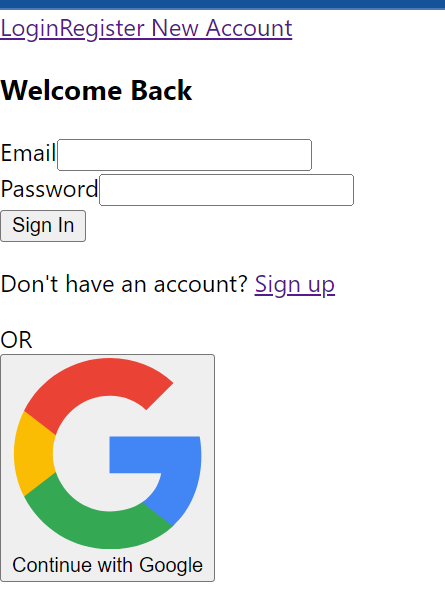

# BADBANK W/Firebase

This project was bootstrapped with [Create React App](https://github.com/facebook/create-react-app).

# Description/Motivation: 
This project exists to showcase a react app and firebase authentication, I built this for a homework assignment via MIT.
## Installation Guidelines:

In the project directory, you can run:

### `npm start`

Runs the app in the development mode.\
Open [http://localhost:3000](http://localhost:3000) to view it in your browser.

The page will reload when you make changes.\
You may also see any lint errors in the console.

### `npm test`

Launches the test runner in the interactive watch mode.\
See the section about [running tests](https://facebook.github.io/create-react-app/docs/running-tests) for more information.

###  `npm run build`

Builds the app for production to the `build` folder.\
It correctly bundles React in production mode and optimizes the build for the best performance.

## Learn More

You can learn more in the [Create React App documentation](https://facebook.github.io/create-react-app/docs/getting-started).

To learn React, check out the [React documentation](https://reactjs.org/).

## Screenshots

## Technology used:
ReactJS. Bootstrap, Express, MongoDB, Firebase
The backend is consisting of a MongoDB instance and a REST API built with Express. The frontend is a React App using bootstrap and react-bootstrap for styling and Firebase for authentication (email signup and/or via Google signup).

## Features

- Users authenticated via Firebase
- Other features to be developed 

## License

MIT